ControlKit is a lightweight controller and gui library for browser environments.
Object properties can be modified with basic control components including buttons, sliders, string and number inputs, checkboxes, selects, color pickers and range inputs. Some more exotic components like xy-pads, value and function plotters provide additional control.

 

[Usage](#usage) — [Setup](#setup) — [Panel](#panel) — [Container](#container) — [Component](#component) — [Styling](#styling) — [Alternatives](#alternatives) —
[Dependencies](#dependencies) — [ChangeLog](#changeLog) — [License](#license)
___
##Usage

When using node or browserify install

    npm install controlkit

and require
    
    var ControlKit = require('controlkit');

Alternatively use the standalone version found in ./bin
    
    
    
or

    
   
___
##Setup

####new ControlKit(options) -> {ControlKit}

The first step in using ControlKit is to create a new instance with some 
optional customisations. The instance created will serve as a root element
for all panels constructed and defines some overall properties such as shared
opacity, styling ...

**Options**

| Name      | Type     | Description                                       |
| --------- | -------- | ------------------------------------------------- |
| opacity   | Number   | Overall opacity,default: 1.0                      |
| useExternalStyle | Boolean | If true, an external style is used instead of the build-in one, default: false |
| history   | Boolean  | (Experimental) Enables a value history for all components, default: false |

####controlKit.setShortcutEnable(char) -> {void}

Defines the char to be used with ctrl + char for enabling / disabling a ControlKit instance.

####~~controlKit.registerKey(key,callback)~~
####~~controlKit.getPanelById(id)->{Panel}~~
####~~controlKit.getGroupById(id)->{Group}~~
####~~controlKit.getSubGroupById(id)->{SubGroup}~~
####~~controlKit.getComponentById(id)->{Component}~~

###Structure

There are two main elements of ControlKit: [containers](#container) and [components](*component*). The latter are constructed per panel and grouped in [Groups](#group) and [SubGroups](#subgroups) which root in [Panels](#panels). To keep the amount of code necessary to set up complex controls to a minimum, groups and components initialisation are chained to their parent panel.

    //html context example
    ...
    
	...

---
##Container

###Panel

The Panel is the main container element. It can either float to the left or right, be draggable or docked. It´s height can be adjusted to its groups or constrained to a certain height. Floated panels get stacked next to each other.

####controlKit.addPanel(options) -> {[Panel](#panel)}

Adds a new Panel.

    controlKit.addPanel();
    //
    var panel = controllKit.addPanel(); //keep ref

**Options**

| Name      | Type     | Description                                       |
| --------- | -------- | ------------------------------------------------- |
| label     | String   | Panel label, default: 'Control Panel'             |
| width     | Number   | Panel width, default: 300                         |
| ratio     | Number   | The ratio of label (default:30%) and component (default:70%) width |
| align     | String   | Float 'left' or 'right', multiple panels get aligned next to each other |
| fixed     | Boolean  | If false the panel can be moved                   |
| position  | Array    | If unfixed, the panel panel position relative to alignment (eg. if 'left' 0 + position[0] or if 'right' window.innerHeight - position[0] - panelWidth) |
| opacity   | Number   | Panel opacity                                     |
| dock      | Boolean  | (Experimental) Indicates whether the panel should be docked to either the left or right window border (depending on params.align), docked panels height equal window height, default: false |

###Group

####panel.addGroup(options)  
Adds a new Group to the Panel.

**Options**

| Name      | Type     | Description                                       |
| --------- | -------- | ------------------------------------------------- |
| label     | String   | Group label, default: ''. If '' or null the group-head collapses |
| useLabel  | Boolean  | Trigger whether all contained SubGroups and Components should use labels, default: true |
| enable    | Boolean  | Defines initial state open / closed, default: true|
| height    | Number   | Defines whether the height of the Group should be constrained to a certain height

###SubGroup

####panel.addSubGroup(options) ->{[Panel](#panel)}

Adds a new SubGroup to the last added Group.
**Options**

| Name      | Type     | Description                                       |
| --------- | -------- | ------------------------------------------------- |
| label     | String   | SubGroup label, default: ''. If '' or null the subgroup-head collapses |
| useLabel  | Boolean  | Trigger whether all Components should use labels, default: true |
| enable    | Boolean  | Defines initial state open / closed, default: true|
| height    | Number   | Defines whether the height of the Group should be constrained to a certain height

    //default init
    controlKit.addPanel()
        .addGroup()
            .addSubGroup()
                .addComponentXY(object,propertyKey);
                
    //If components are immediately added after panel creation,
    //the initial Group and SubGroup are added automatically
    controlKit.addPanel()
        .addComponentXY(object,propertyKey);
        
    //multiple levels  
    controlKit.addPanel()
        .addGroup()
            .addSubGroup()
                .addComponentXYZ(object,propertyKey)
                .addComponentXYZ(object,propertyKey)
                ...
        .addGroup() // add second Group
            .addSubGroup()
                .addComponentXYZ(object,propertyKey)
                ...
            .addSubGroup() // add second SubGroup
                .addComponentXYZ(object,propertyKey)
                ...
        ...
    
---
##Component

[explain linked components here]

	var obj = {
		valueA : 0.25,
		valueB : 1.25,	
		func : function(x,y){
			return Math.sin(x * this.valueA) * Math.cos(y * this.valueB);
		}
	}
	
	var controlKit = new ControlKit();
	
	controlKit.addPanel()
		.addNumberInput(obj,'valueA')
		.addNumberInput(obj,'valueB')
		.addFunctionPlotter(obj,'func');

###Built-in components

####General advice!

All number related components including sliders have an option for specifying the
amount of decimal places. To prevent weird behaviour when updating an objects number property
from different number components with different decimal places settings, make sure to use
the same amount of decimal places in every component modifying the same property.

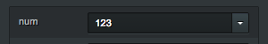 
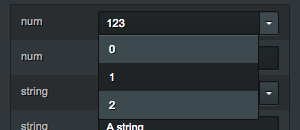
####panel.addNumberInput(object,propertyKey,options) -> {[Panel](#panel)}
    
Adds a new NumberInput to the last added SubGroup. Returns panel.  
**Options**

| Name      | Type     | Description                                       |
| --------- | -------- | ------------------------------------------------- |
| label     | String   | Component label                                   |
| onChange  | Function | Callback on change                                |
| step      | Number   | Amount subbed/added on arrowDown/arrowUp press    |
| dp        | Number   | Decimal places displayed                          |  
| presets   | Array    | A set of presets [0,1,2,3,4]                      |       

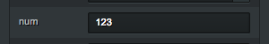
####panel.addNumberOutput(object,propertyKey,options) -> {[Panel](#panel)}

Adds a new NumberOutput to the last added SubGroup. In contrast to NumberInput this component doesn't allow modifying the property.  
**Options**

| Name      | Type     | Description                                       |
| --------- | -------- | ------------------------------------------------- |
| label     | String   | Component label                                   |
| dp        | Number   | Decimal places displayed                          |

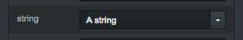 
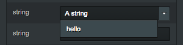
####panel.addStringInput(object,propertyKey,options) -> {[Panel](#panel)}

Adds a new StringInput to the last added SubGroup.  
**Options**

| Name      | Type     | Description                                       |
| --------- | -------- | ------------------------------------------------- |
| label     | String   | Component label                                   |
| onChange  | Function | Callback on change                                |
| presets   | Array    | A set of presets ['abc','def','ghi']              |

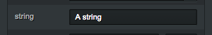
####panel.addStringOutput(object,propertyKey,options) -> {[Panel](#panel)}

Adds a new StringOutput to the last added SubGroup. In contrast to StringInput this component doesn't allow modifying the property.  
**Options**

| Name      | Type     | Description                                       |
| --------- | -------- | ------------------------------------------------- |
| label     | String   | Component label                                   |

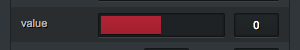
####panel.addSlider(object,propertyKey,rangeKey,options) -> {[Panel](#panel)}

Adds a new Slider to the last added SubGroup.

    var obj = {value:0,range:[-1,1]};
    
    panel.addSlider(obj,'value','range');
**Options**

| Name      | Type     | Description                                       |
| --------- | -------- | ------------------------------------------------- |
| label     | String   | Component label                                   |
| onChange  | Function | Callback on drag                                  |
| onFinish  | Function | Callback on drag end                              |
| step      | Number   | Amount subbed/added on arrowDown/arrowUp press    |
| dp        | Number   | Decimal places displayed                          | 

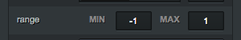
####panel.addRange(object,propertyKey,options) -> {[Panel](#panel)}

Adds a new Checkbox to the last added SubGroup.
**Options**

| Name      | Type     | Description                                       |
| --------- | -------- | ------------------------------------------------- |
| label     | String   | Component label                                   |
| onChange  | Function | Callback on change                                |

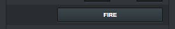
####panel.addButton(label,onPress,options) -> {[Panel](#panel)}

Adds a new Button to the last added SubGroup.

    panel.addButton('fire',function(){console.log('Peng!);});
**Options**

| Name      | Type     | Description                                       |
| --------- | -------- | ------------------------------------------------- |
| label     | String   | Component label                                   |

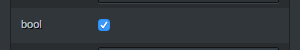
####panel.addCheckbox(object,propertyKey,options) -> {[Panel](#panel)}

Adds a new Checkbox to the last added SubGroup.
**Options**

| Name      | Type     | Description                                       |
| --------- | -------- | ------------------------------------------------- |
| label     | String   | Component label                                   |
| onChange  | Function | Callback on change                                |

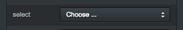 
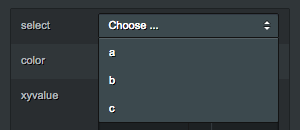
####panel.addSelect(object,propertyKey,options) -> {[Panel](#panel)}

Adds a new Select to the last added SubGroup.

    var obj = {
        options:['Some','options','to','choose'], 
        selection : this.options[3]};
    
    panel.addSelect(obj,'options',{
        onChange:function(index){
            obj.selection = obj.options[index];});
            
    //or
    panel.addSelect(obj,'options',{target:'selection'});

**Options**

| Name      | Type     | Description                                       |
| --------- | -------- | ------------------------------------------------- |
| label     | String   | Component label                                   |
| onChange  | Function | Callback on select - function(index){}            |
| target    | String   | Target property key - property to be set on select|

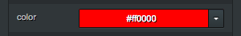 
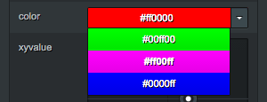 
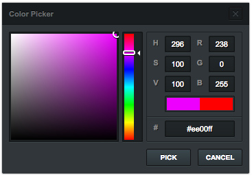
####panel.addColor(object,propertyKey,options) -> {[Panel](#panel)}

Adds a new Color modifier to the last added SubGroup.

    var obj = {color:'#ff00ff'};
    
    panel.addColor(obj,'color',{colorMode:'hex'});

**Options**

| Name      | Type     | Description                                       |
| --------- | -------- | ------------------------------------------------- |
| label     | String   | Component label                                   |
| onChange  | Function | Callback on change                                |
| colorMode | String   | The colorMode to be used: 'hex' #ff00ff, 'rgb' [255,0,255], 'rgbfv' [1,0,1] |
| presets   | Array    | A set of preset colors matching params.colorMode  |

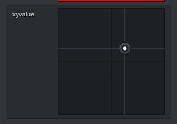
####panel.addPad(object,propertyKey,options) -> {[Panel](#panel)}

Adds a new XY-Pad to the last added SubGroup.
**Options**

| Name      | Type     | Description                                       |
| --------- | -------- | ------------------------------------------------- |
| label     | String   | Component label                                   |

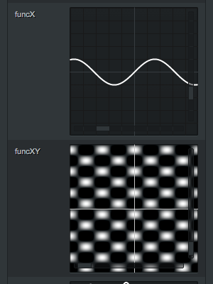
####panel.addFunctionPlotter(object,propertyKey,options) -> {[Panel](#panel)}

Adds a new FunctionPlotter to the last added SubGroup.
**Options**

| Name      | Type     | Description                                       |
| --------- | -------- | ------------------------------------------------- |
| label     | String   | Component label                                   |
| lineWidth | Number   | Graph line width                                  |
| lineColor | Array    | Graph line color [255,255,255]                    | 

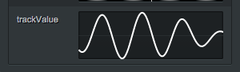
####panel.addValuePlotter(object,propertyKey,options) -> {[Panel](#panel)}

Adds a new ValuePlotter to the last added SubGroup.
**Options**

| Name      | Type     | Description                                       |
| --------- | -------- | ------------------------------------------------- |
| label     | String   | Component label                                   |
| height    | Number   | Plotter height                                    |
| resolution| Number   | Graph resolution                                  |
| lineWidth | Number   | Graph line width                                  |
| lineColor | Array    | Graph line color [255,255,255]                    |            

###Custom Components

####~~Custom Canvas Component~~ 
####~~Custom SVG Component~~ 

###Sync to external change

If a value gets changed externally, eg in an update loop, you can sync ControlKit by using:
*(be aware that this might have a quite huge performance impact when using complex control setups)*

	update(){	//your update loop
		controlKit.update();
	}
  
---
##Styling

If the default styling is too photoshoppy for your taste, you can completly replace it by modifying the default one located in [./style](../master/style/).  

Its written in scss and split into [_images.scss](../master/style/_images.scss) (up/down arrows, close btn images, undo ...), [_presets.scss](../master/style/_presets.scss) (all variables, sizes, colors, ratios, font related...) and [style.scss](../master/style/style.scss) (defining the actual structure). Although a great amount of time has been spend translating the designs to css, the files need a little cleanup and restructure. 
  
**Apply your custom style** by either using an *external stylesheet* (eg. when developing a custom style) via:

    var controlKit = new ControlKit({useExternalStyle:true});

Or create a *standalone version* of controlKit with a custom built-in style using:

    utils/node build -o outFileDir -s yourCustomCSS
    
If for some reason, you want to *completly replace* the default styling. Alter it within the original folder and just run.

	utils/node update

This will inject the new default style into to the packaged version controlKit.js and controlKit.min.js within ./bin, but will also completly replace the default module version.

---
##Alternatives

[dat.gui](https://github.com/dataarts/dat.gui) — The de facto standard    
[Palette](https://github.com/lehni/palette.js) — Juerg Lehni  
[Guido](https://github.com/fjenett/Guido) — Processing.js compatible, Florian Jenett

##DevDepencies   
[browserify](https://github.com/substack/node-browserify)  
[uglify-js](https://github.com/mishoo/UglifyJS2)
[clean-css](https://github.com/jakubpawlowicz/clean-css)

##License

The MIT License (MIT)

Copyright (c) 2013-2014 Henryk Wollik

Permission is hereby granted, free of charge, to any person obtaining a copy of this software and associated in the Software without restriction, including without limitation the rights to use, copy, modify, merge, publish, distribute, sublicense, and/or sell copies of the Software, and to permit persons to whom the Software is furnished to do so, subject to the following conditions:

The above copyright notice and this permission notice shall be included in all copies or substantial portions of the Software.

THE SOFTWARE IS PROVIDED "AS IS", WITHOUT WARRANTY OF ANY KIND, EXPRESS OR
IMPLIED, INCLUDING BUT NOT LIMITED TO THE WARRANTIES OF MERCHANTABILITY,
FITNESS FOR A PARTICULAR PURPOSE AND NONINFRINGEMENT. IN NO EVENT SHALL THE AUTHORS OR COPYRIGHT HOLDERS BE LIABLE FOR ANY CLAIM, DAMAGES OR OTHER LIABILITY, WHETHER IN AN ACTION OF CONTRACT, TORT OR OTHERWISE, ARISING FROM, OUT OF OR IN CONNECTION WITH THE SOFTWARE OR THE USE OR OTHER DEALINGS IN THE SOFTWARE.
