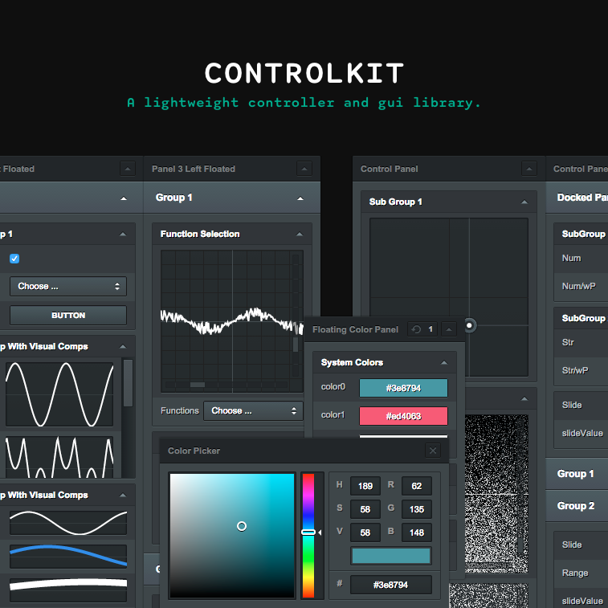

D R A F T & E X P E R I M E N T A L

ControlKit.js is a lightweight controller and gui library for browser environments.
Object properties can be modified with basic control components such
as buttons, sliders, string and number inputs,  checkboxes,  selects, color pickers and
range inputs. Some more exotic components like xy-pads, value and function plotters do provide additional
control. * Display components *

##Install

When using node or browserify

    npm install controlkit
Alternatively use the standalone version found in ./bin.

    

##Usage

Control components are constructed per panel.

    var obj = {
            number : 1.0,
            string : 'abc'
        };

    ControlKit.setup();
    ControlKit.addPanel().
                addGroup().
                    addSubGroup().
                        addNumberInput(obj,'number');
                addGroup().
                    addSubGroup().
                        addStringInput(obj,'string');

    //or when you want to change the appearance within your application
    var panel = ControlKit.addPanel().  //just keep a ref to the panel
                    addGroup().
                        ...
                            close(); //and reopen it later via panel.open();

##Custom components

##Styling

The default styling can be customized. You can either pass a new style on setup:

    ControlKit.setup({style:yourCustomStyleString});

Use an external stylesheet (eg. when developing a custom style) via:

    ControlKit.setup({useExternalStyle:true});

Or create a standalone version of controlKit with a custom built-in style using:

    bin/.build -o outfilePath -s yourCustomStyleStringOrCssFile

##Documentation

See wiki
