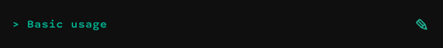

D R A F T & E X P E R I M E N T A L

ControlKit.js is a lightweight controller and gui library for browser environments.
Object properties can be modified with basic control components such
as buttons, sliders, string and number inputs,  checkboxes,  selects, color pickers and
range inputs. Some more exotic components like xy-pads, value and function plotters do provide additional
control. * Display components *

 
 

When using node or browserify

    npm install controlkit

Alternatively use the standalone version found in ./bin.

    

 
 

The two main elements of ControlKit are containers and components. The latter are constructed per panel and
grouped in Groups and SubGroups. To keep the amount of code necessary to setup complex controls to a minimum,
container and component initialization are chained to their parent panel. This way you can write:

    var obj = {
            number : 1.0,
            string : 'abc'
        };

    ControlKit.setup();
    ControlKit.addPanel().
                addGroup().
                    addSubGroup().
                        addNumberInput(obj,'number').
                addGroup().
                    addSubGroup().
                        addStringInput(obj,'string');

    //or when you want to change the appearance within your application
    var panel = ControlKit.addPanel().  //just keep a ref to the panel
                    addGroup().
                        ...
                            close(); //and reopen it later via panel.open();

Customization of groups and components is done via option objects passed on initialization.
All components are interlinked. This way whenever an object property is changed all other components depending
on or manipulating the same property get updated.
 
 

###Style

The default styling can be customized. You can either pass a new style on setup:

    ControlKit.setup({style:yourCustomStyleString});

Use an external stylesheet (eg. when developing a custom style) via:

    ControlKit.setup({useExternalStyle:true});

Or create a standalone version of controlKit with a custom built-in style using:

    utils/.build -o outfilePath -s yourCustomStyleStringOrCssFile

###Custom Components

 
 

See wiki
